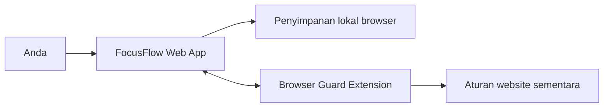

# Memahami FocusFlow

Dokumen ini menjelaskan arsitektur FocusFlow dengan bahasa sederhana. Untuk
langkah penggunaan sehari-hari, lihat [Panduan Penggunaan](USER_GUIDE.md).

## Gambaran sederhana

FocusFlow terdiri dari dua bagian yang bekerja bersama:



- **Web app** menampilkan timer, task, statistik, Focus Guard, distraction
  inbox, review, dan focus sound.
- **Penyimpanan lokal browser** menyimpan seluruh data pribadi. Tidak ada akun,
  backend, Supabase, atau cloud sync pada versi sekarang.
- **Browser Guard extension** menerima snapshot sesi terlindungi dan memasang
  aturan website hanya selama sesi tersebut berlaku.

## Isi folder utama

- `src/app/`: halaman dan layout utama.
- `src/components/`: komponen timer, task, Guard, statistik, dan sound.
- `src/hooks/`: lifecycle serta koordinasi state aplikasi.
- `src/lib/`: persistence, validasi, bridge extension, dan utilitas.
- `src/types/`: kontrak data TypeScript.
- `extension/`: source Manifest V3 Browser Guard.
- `scripts/`: verification harness untuk lifecycle dan extension.
- `docs/focus-guard/`: keputusan desain dan handoff setiap phase.

## Bagaimana timer tetap akurat

Timer aktif tidak hanya mengurangi angka setiap detik. FocusFlow menyimpan
deadline dan menghitung sisa waktu menggunakan jam perangkat. Karena itu,
refresh, background tab, atau sleep tidak sekadar memperpanjang sesi. Timer yang
paused menyimpan sisa waktu secara eksplisit.

## Bagaimana Focus Guard bekerja

Focus Guard bersifat opt-in. Protected session dimulai melalui Focus Contract
dan menyimpan snapshot target, profile, rule, durasi, serta ID sesi. Web app dan
extension menggunakan protocol tervalidasi untuk menyinkronkan snapshot
sementara. Snapshot memiliki expiry sehingga aturan tidak tertinggal ketika
halaman tertutup atau komunikasi terputus.

Extension tidak membaca history browser, daftar tab, clipboard, screenshot,
keystroke, atau isi halaman. Permission website diberikan secara spesifik oleh
pengguna untuk origin yang diperlukan profile.

## Di mana data tersimpan

Task, timer, target, riwayat sesi, profile, distraction, dan review berada di
`localStorage` browser. Snapshot extension sementara berada di
`chrome.storage.session`. Konsekuensinya:

- data tidak otomatis berpindah ke perangkat lain;
- menghapus site data dapat menghapus data FocusFlow;
- deployment web tidak otomatis membuat cloud sync;
- orang lain yang membuka deployment yang sama memperoleh penyimpanan lokalnya
  sendiri, bukan data milik Anda.

## Menjalankan dan memverifikasi

Penggunaan harian sebaiknya memakai production build:

```powershell
npm run build
npm run start
```

Untuk pengembangan gunakan `npm run dev`. Browser Guard versi saat ini hanya
terhubung ke origin yang dicantumkan secara eksplisit dalam manifest dan bridge.

Verification utama tersedia melalui script di `package.json`, termasuk lint,
TypeScript, production build, extension checks, phase harness, dan resource
bounds.
